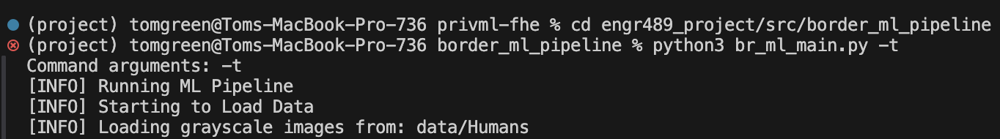
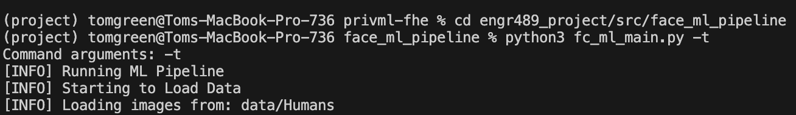
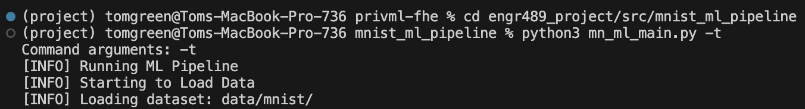
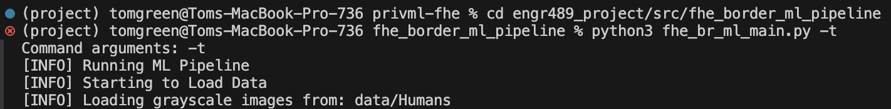
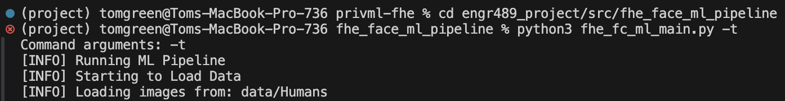
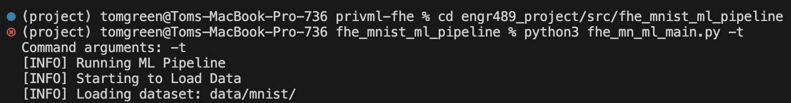
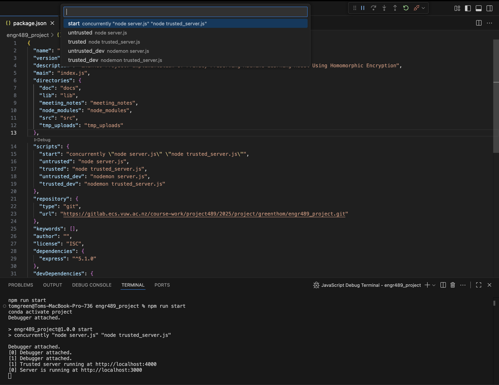
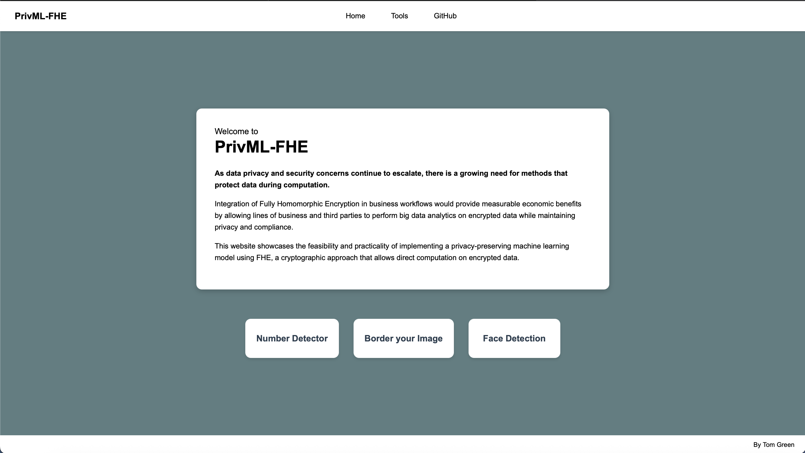

# How To Run

## Steps to install pacakages/libraries

For steps to install libraries and packages used for model training/testing and running the web application, please refer to [requirements](requirements.md) file.

## Steps To Run Model Training/Testing Pipelines

Each model pipeline can be run in **Testing** and **Final** mode. **Testing** should be used when trying different parameters set in the pipeline `config.py` file. **Final** should be run when you want to output a model (saved to [name].path in the corresponding ../models directory) to then use with the web application. To use the output model with the web server, change the model path in the corresponding `config.py` file to the name of the `model.pth` output.

### Non-Encrypted Models

#### Border Pipeline

1. Move to the border_ml_pipeline directory: `cd src/border_ml_pipeline`.
1. If you want to make model/parameter adjustments, make changes in the [br_config.py](./src/border_ml_pipeline/br_config.py) file.
1. Ensure that the `Human` dataset used to train the model is in the ../data/Humans. If dataset is not present please download it from Kaggle at this [dataset-link](https://www.kaggle.com/datasets/ashwingupta3012/human-faces?resource=download). Then paste it into the `../border_ml_pipeline/data` directory. If you want to use a different dataset to train model, make sure to put it in the ../data folder and change the file path in the [br_config.py](./src/border_ml_pipeline/br_config.py) file.
1. To run in **Testing** mode: `python3 br_ml_main.py -t`.
1. To run in **Final** mode: `python3 br_ml_main.py -f`.

#### Face Pipeline

1. Move to the face_ml_pipeline directory: `cd src/face_ml_pipeline`.
1. If you want to make model/parameter adjustments, make changes in the [fc_config.py](./src/face_ml_pipeline/fc_config.py) file.
1. Ensure that the `Human` dataset used to train the model is in the ../data/Humans. If dataset is not present please download it from Kaggle at this [dataset-link](https://www.kaggle.com/datasets/ashwingupta3012/human-faces?resource=download). Then paste it into the `../face_ml_pipeline/data` directory. If you want to use a different dataset to train model, make sure to put it in the `../data` folder and change the file path in the [fc_config.py](./src/face_ml_pipeline/fc_config.py) file.
1. To run in **Testing** mode: `python3 fc_ml_main.py -t`.
1. To run in **Final** mode: `python3 fc_ml_main.py -f`.

#### MNIST Pipeline

1. Move to the mnist_ml_pipeline directory: `cd src/mnist_ml_pipeline`.
1. If you want to make model/parameter adjustments, make changes in the [mn_config.py](./src/mnist_ml_pipeline/mn_config.py) file.
1. Ensure that the `MNIST` dataset used to train the model is in the ../data/mnist. If dataset is not present please download it from Kaggle at this [dataset-link](https://www.kaggle.com/datasets/hojjatk/mnist-dataset/data). Then paste it into the `../mnist_ml_pipeline/data` directory. If you want to use a different dataset to train model, make sure to put it in the `../data` folder and change the file path in the [mn_config.py](./src/mnist_ml_pipeline/mn_config.py) file.
1. To run in **Testing** mode: `python3 mn_ml_main.py -t`.
1. To run in **Final** mode: `python3 mn_ml_main.py -f`.

### Encrypted Models

#### FHE Border Pipeline

1. Move to the fhe_border_ml_pipeline directory: `cd src/fhe_border_ml_pipeline`.
1. If you want to make model/parameter adjustments, make changes in the [fhe_br_config.py](./src/fhe_border_ml_pipeline/fhe_br_config.py) file.
1. Ensure that the `Human` dataset used to train the model is in the ../data/Humans. If dataset is not present please download it from Kaggle at this [dataset-link](https://www.kaggle.com/datasets/ashwingupta3012/human-faces?resource=download). Then paste it into the `../fhe_border_ml_pipeline/data` directory. If you want to use a different dataset to train model, make sure to put it in the `../data` folder and change the file path in the [fhe_br_config.py](./src/fhe_border_ml_pipeline/fhe_br_config.py) file.
1. To run in **Testing** mode: `python3 fhe_br_ml_main.py -t`.
1. To run in **Final** mode: `python3 fhe_br_ml_main.py -f`.

#### FHE Face Pipeline

1. Move to the fhe_face_ml_pipeline directory: `cd src/fhe_face_ml_pipeline`.
1. If you want to make model/parameter adjustments, make changes in the [fhe_fc_config.py](./src/fhe_face_ml_pipeline/fhe_fc_config.py) file.
1. Ensure that the `Human` dataset used to train the model is in the ../data/Humans. If dataset is not present please download it from Kaggle at this [dataset-link](https://www.kaggle.com/datasets/ashwingupta3012/human-faces?resource=download). Then paste it into the `../fhe_face_ml_pipeline/data` directory. If you want to use a different dataset to train model, make sure to put it in the `../data` folder and change the file path in the [fhe_fc_config.py](./src/fhe_face_ml_pipeline/fhe_fc_config.py) file.
1. To run in **Testing** mode: `python3 fhe_fc_ml_main.py -t`.
1. To run in **Final** mode: `python3 fhe_fc_ml_main.py -f`.

#### FHE MNIST Pipeline

1. Move to the fhe_mnist_ml_pipeline directory: `cd src/fhe_mnist_ml_pipeline`.
1. If you want to make model/parameter adjustments, make changes in the [fhe_mn_config.py](./src/fhe_face_mnist_pipeline/fhe_mn_config.py) file.
1. Ensure that the `MNIST` dataset used to train the model is in the ../data/mnist. If dataset is not present please download it from Kaggle at this [dataset-link](https://www.kaggle.com/datasets/hojjatk/mnist-dataset/data). Then paste it into the `../fhe_mnist_ml_pipeline/data` directory. If you want to use a different dataset to train model, make sure to put it in the `../data` folder and change the file path in the [fhe_mn_config.py](./src/fhe_mnist_ml_pipeline/fhe_mn_config.py) file.
1. To run in **Testing** mode: `python3 fhe_mn_ml_main.py -t`.
1. To run in **Final** mode: `python3 fhe_mn_ml_main.py -f`.

## Steps To Run Web Server

Ensure that you have followed [requirements.md](requirements.md) to install npm packages and node modules needed to run the web server.

Ensure that the path to your python kernel is specified in the [server.js](server.js) on `line 11` and [trusted_server.js](trusted_server.js) on `line 11` so both servers can run the python scripts associated with running the models. Change the paths specified to the python kernel you set up following instructions in [requirements.md](requirements.md).

1. Access the [package.json](package.json) file.
1. To run press debug, and then select "start" from the dropdown that appears to run the Untrusted-server and Trusted-server.
1. In the terminal log it will prompt you with http address to access the untrusted `Server` OR you can search in your web browser <http://localhost:3000>

