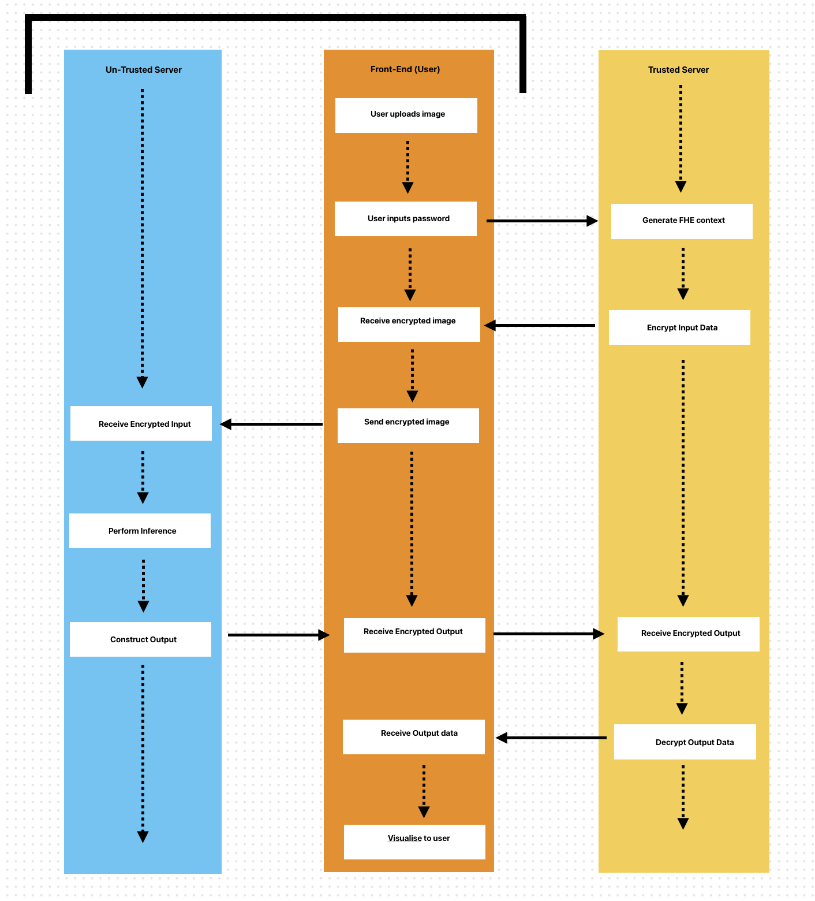

# Web Server

## Components

The web application is structured into several key components that work together to provide a smooth user experience. The frontend interface is built using HTML and CSS, giving users a clean, responsive layout for uploading images and viewing results. The JavaScript logic handles interactivity, including image capture, uploads, and displaying inference outputs. On the backend, a Python inference service processes incoming images, running them through the trained machine learning model for either border generation or face detection. This backend is connected via HTTP endpoints, enabling the frontend to send images and receive predictions in real time. Finally, the model and preprocessing pipeline convert raw inputs into usable predictions, which are then rendered visually on the user’s screen. FHE component is yet to be implemented.

## node.js setup

To refer to requirements need to run web application, please refer to [requirements](../../requirements.md)

## Directory Components

### start

- Starting page of the web-application.
- Shows a short blurb of what the web-application is, about, and does.
- Holds the main components of the website setup, including header and footer.
- Holds core functionality, called across directories.

### border_ml

- Consists of the tool page for the border ml pipeline.
- Users submits an image, which they then pass to the trained model.
- Output is then displayed back to the user which they can then save, or reset and go again.
- FHE follows similar workflow, however user submits a password that is associated with their encryption context and is required to decrypt the result.

## face_ml

- Consists of the tool page for the face ml pipeline.
- User submits an image, which they then pass to the trained model.
- Output is then displayed back to the user which they can then save, or reset and go again.
- FHE follows similar workflow, however user submits a password that is associated with their encryption context and is required to decrypt the result.

### mnist_ml

- Consists of the tool page for the mnist ml pipeline.
- User can draw a number (0-9), which they can then pass to the trained model.
- Output then classifies what number the user has drawn which is displayed back to them.
- User can reset and draw another image at any time.
- FHE follows similar workflow, however user submits a password that is associated with their encryption context and is required to decrypt the result.
